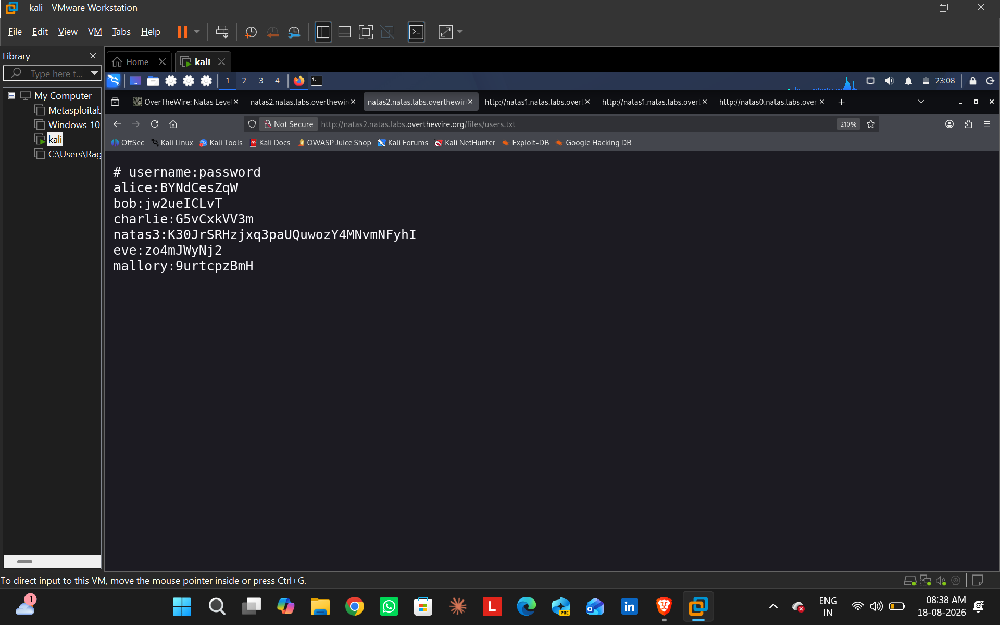

# Natas Level 2 ➔ Level 3

- **Target URL:** `http://natas2.natas.labs.overthewire.org`
- **Vulnerability:** Unlinked Directory Traversal / Information Disclosure

### Execution & Solution
1. Authenticated to Level 2 in Firefox using the credentials retrieved from Level 1 (`natas2:vsD0xoXyq3wckCP1ZmTZ7lngIA606odB`).
2. Inspected the HTML source code (`Ctrl + U`) and observed an unlinked resource path: ``.
3. Navigated directly to the parent directory: `http://natas2.natas.labs.overthewire.org/files/`.
4. Opened `users.txt` from the index listing to retrieve the password for **natas3**.

### Retrieved Password for Natas3
`K3OJrSRHzjxq3paUQuwozY4MNvmNFyhI`

### Proof Screenshot

